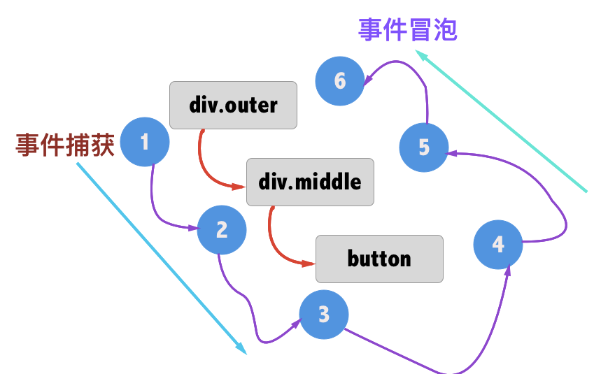

* 插值{{}}

	```
	data:{
		name:"爱尚舞模式",
		age:19
	}
	<div>{{name}}</div>
	
	<div>{{name.xxx()}}</div>
	```
	
* html插值 v-html

	```
	data:{
		content:"<div>my name is {{name}}</div>"
	}
	
	<div>{{content}}</div>不会正常显示html标签 当做字符串显示
	
	<div v-html="content"/>
	```
* 属性绑定 v-bind  可以简写为 : [v-vind:a == :a]

	```
		<div  v-bind:id=""/>
		<a v-bind:href="url">...</a>
		<button  v-bind:disabled=""/>
		
		<a v-bind:[attrname]="url">...</a> 2.6以后新增 
	```

* 指令

	* v-if | v-else-if | v-else  元素不显示会被销毁
	
		```
		结合<template>使用
		
		<div v-if="a==1"></div>
		<div v-else-if="a==1"></div>
		<div v-else></div>
		
		<template v-if="show">
			<div/>
			<div/>
		</template>
		<div v-else/>
		```
		```
			<div v-if='show'>
				<label >AAA:</label>
				<input placeholder="AAA">
			</div>
			<div v-else>
				<label >BBB:</label>
				<input placeholder="BBB">
			</div>
		
		=====
		
			<div v-if='show'>
				<label >AAA:</label>
				<input placeholder="AAA" key="aa">
			</div>
			<div v-else>
				<label >AAA:</label>
				<input placeholder="BBB" key='bb'>
			</div>
		Vue 会重复使用部分元素
		第一种在切换过程中input会被重新利用 [输入框的值会被保留]
		指定key值 就会变成唯一 
		```
	* v-show 元素还是存在 display:none
		
		```
		不支持template
		<h1 v-show="ok">Hello!</h1>
		```
		
	* v-for 

		```
		1：不推荐同时使用 v-if 和 v-for v-for 具有比 v-if 更高的优先级
		2：提供一个key[字符串或数值] 值 以便标记 重用和重新排序现有元素 
		```
		```
		v-for="n in 10" 
		数组
		v-for="item of items" v-bind:key=""
		v-for="(item,index) of items" v-bind:key=""
		v-for="(item,index) in items" v-bind:key=""
		
		对象
		v-for="value in obj" v-bind:key=""
		v-for="(value,key) in obj" v-bind:key=""
		```
		
		```
		数组的某些方法是进过包装的。调用会触发对应的刷新
			push()
			pop()
			shift()
			unshift()
			splice()
			sort()
			reverse()
			
		以下方法不会触发
			items[index] =xx;
				解决==>Vue.set=vue.$set(items,index,vaue)
				
			items.length = 111
				解决==>items.splice(newLength)
		
		```
		
		```
		对象的变更检测
		let vm = new Vue({
			data:{
				xxxx：1
			}
		})
		Vue不支持根级别的新增  [data.b 无效]
		可以支持响应对象属性进行新增
		
		Vue.set== vm.$set(data.a,name,"zzh")
		
		vm. xxxx =  Object.assign({}, vm.xxx,{ name:xxx}}
		```
		
		```
		注意事项
		v-for  v-if同时使用 v-for的优先级高
			<div  v-for="th in things" v-if='th.isFinish' >
				<div />//仅仅显示已经完成的事
			</div>
		
		v-for和组件配合
			<div v-for="item in []">
				<item-cell 
					v-bind:xx="item.xx"
					....
					item不能自动注入到组件
					需要属性绑定
					===>隔离作用域
				/>
			</div>		
		v-for ul li
			ul下只有li为合法标签
			<ul>
				<li
					is='item-cell'
				/>
				===
				<item-cell />
			</ul>	
		```
	
	* v-on: == @ 对事件进行绑定
	* v-bind: == : 对属性进行绑定
		
		```
			v-bind 和 v-bind:区别 同 v-on 和v-on:
			
			v-bind:xx 对某个属性值进行绑定
				绑定的所有属性监听都会在组件的$attrs上
			v-bind="$attrs" 	
				对组件$attrs 进行整体绑定修改
				
			见组件实例
		```

* class Style

	* class 和 v-bind:class 可以同时存在

		```
		内联  data  计算属性都可以
		 三元计算 v-bind:class="[isActive ? activeClass : '']"
		
		 v-bind:class="{hasBorder:true,hasPadding:false}"
		 
		 计算 v-bind:class="classObj"
			 computed:{
			 	classObj(){
			 		return {
			 			hasBorder:this.isAction,
			 			....
			 		}		
			 	}		 
			 }
		 数组 <div v-bind:class="[activeClass, errorClass]"></div>
		```
	* v-bind:style  css 名字必须是驼峰标识[backgroundColor:red]

		```
		内联  data  计算属性都可以
		内联 v-bind:style="{ 
			color: activeColor, 
			fontSize: fontSize + 'px',
			backgroundColor:'red' }"
		
		属性 <div v-bind:style="styleObject"></div>
		
		数组 v-bind:style="[a,b]"
		
		多重值 :style="{ display: ['-webkit-box', '-ms-flexbox', 'flex'] }"
		 ==> display:flex
		```
* v-model 进行表单数据绑定

	* v-model会用data的初始值。 忽略value、checked、selected默认值
	* 负责监听用户的输入事件以更新数据

	* 事件
		* text input 和 textarea 元素使用 value 属性和 input 事件；
		* checkbox 和 radio 使用 checked 属性和 change 事件；
		* select 字段将 value 作为 prop 并将 change 作为事件。

	* 表单控件

		* input textarea

			```
			<textarea v-model="message" placeholder="add multiple lines"></textarea>
			<p style="white-space: pre-line;">{{ message }}</p>
			```
			
			
		* checkbox radio
			
			```
			new Vue({
				data:{
					checks:[]
				}
			})
			<div>
		        <label for="a">AAA</label><input type="checkbox" id="a" v-model="checks" value="AAAA"/>
		        <label for="b">BBB</label><input type="checkbox" id="b" v-model="checks" value="BBBB"/>
		        <label for="c">CCC</label><input type="checkbox" id="c" v-model="checks" value="CCCC"/>
		        <span/>
		        <div>{{checks}}</div>
			</div>
			```
			```
			<input
				  type="checkbox"
				  v-model="toggle"
				  true-value="AAA" //true 值为AAA
				  false-value="BBB"
				>
			new Vue({
				data:{
					toggle:"AAA"
				}
			})
			```
		* select

			```
			<select v-model="selected">
				<option  v-for="one in [1,2,3,4]" v-bind:value="one"/>
			</select>
			```
			
			```
			<select v-model="selected">
			    <!-- 内联对象字面量 -->
			  <option v-bind:value="{ number: 123 }">123</option>
			</select>
			```
* .sync 2.3以后 简化对单个Props进行双休绑定 [见组件]
*  .native 对组件根元素进行原生事件绑定 [见组件]

* 事件绑定 ，修饰符
	
	```
	v-on:click ==@click
	
	<div @click="count += 1"/> 
	<div @click="addCount"/> 
	<div @click="addCount(type,$event)"/> 
	```
	
	* 修饰符
		
		
		* 事件 click keyup keydown scroll mouseover ...
		* 点击事件的处理
		* 滚动事件处理
		* 修饰符的说明
		* 键盘按键事件
		* 鼠标事件

		```
		capture 事件捕捉阶段
			v-on:click.capture="doThis"	
			即内部元素触发的事件先在此处理，然后才交由内部元素进行处理
		stop
			 防止事件冒泡 event.stopPropagation()
			 
		prevent
			click.prevent
			event.preventDefault()，用于取消默认事件
			
		self
			事件的发起者是自己 而不是子元素[只有点击自己才会触发该方法]
		once 
			事件只能触发一次
			可以做在组件上
			
		. passive滚定 2.3以后 尤其能够提升移动端的性能。
			div @scroll. passive=""
		
		.stop.prevent
			修饰符串联
			
		按键修饰器
			.enter
			.tab
			.delete (捕获“删除”和“退格”键)
			.esc
			.space
			.up 方向键
			.down 方向键
			.left 方向键 或者 鼠标左键
			.right 方向键 或者 鼠标右键
			.middle 鼠标中键
				@keyup.enter == @keyup.13  
				@keyup = “”所有键盘事件触发
				<input @keyup.right=""/> 获取焦点后 点击->方向键
				<div @click.right =""/>   鼠标点击 要求是右键点击
			
			
			系统修饰键 ctrl...  多键触发 【用作组合按键】
			 	@keyup.ctrl=""是无效的   
			 		==>@keyup.17  ctrl键被点击
				@keyup. ctrl.17 ctrl 按下 再按17键	
				<input @keyup.alt.67="clear">
					<!-- Alt + C -->
					
			exact 对事件精确控制 2.5版本
				@click. exact 表示有且仅有click事件才能触发 比如说按下shift键 同时点击 也不能触发
			
			鼠标事件 [可以单独使用系统修饰符]
				@mouseover.ctrl=""
				@mousedown.ctrl
				
		自定义按键修饰符
				Vue.config.keyCodes.f1 = 112
					@keyup.f1 == 按下112键
				Vue.config.keyCodes.PageDown = 112
					@keyup.page-down 
				
		```
	
	
* is 和 :is
	
	* 限制范围 (以下的不受限制) 。仅仅通过cdn方式 网页加载时 出现
		
		* 字符串 (例如：template: '...')
		* 单文件组件 (.vue)
		* < script type="text/x-template">
		
	* html模板的限制，于是就诞生了is
		
		```
		<ul>
			<li>
			<LiContent />无效
			<li is="LiContent"/>可行
		</ul>
		```
	* :is 类似is  仅仅是动态绑定 【可以用作切换显示功能】

		```
		<ul>
			<li  :is="LiCo"/ >
		</ul>
		
		data:{
			LiCo:"组件名称"
		}
		```
	

* 对动态参数的约定

	* 动态参数名称需要全部小写
		
		```
		<div on-bind:[attrName] =''/>
		会自动转为
		<div on-bind:[attrname] =''/>
		```
	* 因为某些字符，如空格和引号 会引起警告